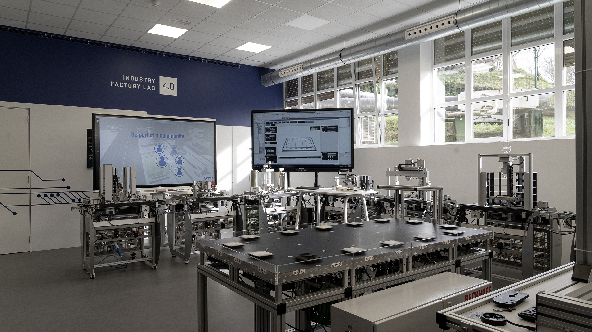

# 🌌 SCLF Meta-Workspace



### Tknika's Smart Collaborative Learning Factory

[](https://github.com/Tknika-SCLF)
[](https://github.com/Tknika-SCLF/SCLF-Meta-Workspace)
[](https://tknika-sclf.github.io/SCLF-Meta-Workspace/)

---

## 🚀 Overview

This repository centralizes all components of the **SCLF** (Smart Collaborative Learning Factory) platform, following the official **Tknika Branding** design system. It uses **Git Submodules** to manage each module independently.

---

## 🛠️ System Modules

### 🤖 Products
*   **[🦾 SCLF Gripper](https://github.com/Tknika-SCLF/SCLF_Gripper_v1.0)**: Control of actuators and robotic manipulators.
*   **[🛸 SCLF Drone](https://github.com/Tknika-SCLF/sclf-drone)**: Unmanned aerial systems.
*   **[🐕 SCLF Quadruped](https://github.com/Tknika-SCLF/sclf-quadruped-robot)**: Quadruped robotic platform.

### 📊 Process
*   **[📋 BOM Registry](https://github.com/Tknika-SCLF/sclf-bom-registry)**: Materials and components management.
*   **[🏭 IkasMES](https://github.com/Tknika-SCLF/sclf-ikasmes)**: Manufacturing Execution System (MES).
*   **[⚙️ Manufacturing](https://github.com/Tknika-SCLF/sclf-manufacturing-processes)**: Industrial process definition.
*   **[🦾 Mobile Robotics](https://github.com/Tknika-SCLF/sclf-mobile-robotics)**: Mobile robot integration in processes.
*   **[👁️ Computer Vision](https://github.com/Tknika-SCLF/sclf-computer-vision)**: Image processing and AI detection.
*   **[🧊 XPlanar System](https://github.com/Tknika-SCLF/sclf-xplanar)**: Intelligent magnetic transport system.

### 📚 Training
*   **[📖 Educational Content](https://github.com/Tknika-SCLF/sclf-educational-content)**: Didactic material and tutorials.
*   **[🏠 Project Hub](https://github.com/Tknika-SCLF/sclf-tknika-project-hub)**: Tknika's coordination center.

### ✅ Standards
*   **[🛡️ Quality](https://github.com/Tknika-SCLF/sclf-quality)**: Quality control and regulations.
*   **[📄 Templates](https://github.com/Tknika-SCLF/sclf-templates)**: Design and documentation templates.

---

## 📥 Environment Setup

To start working with the complete ecosystem, clone this repository with the `--recursive` flag:

```powershell
git clone --recursive https://github.com/Tknika-SCLF/SCLF-Meta-Workspace.git
```

---

<div align="center">
  <sub>Developed by <b>Antigravity AI</b> for the <b>AiotR</b> team</sub>
</div>
