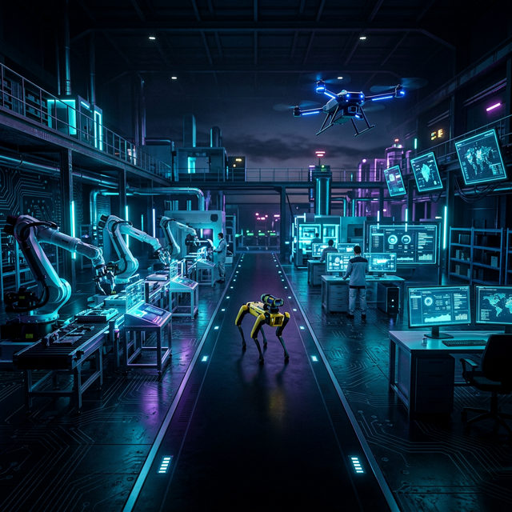

<style>
  :root {
    --primary: #00d2ff;
    --secondary: #3a7bd5;
    --bg-dark: #0f172a;
    --card-bg: rgba(30, 41, 59, 0.7);
    --text-main: #f1f5f9;
    --text-dim: #94a3b8;
  }

  body {
    background-color: var(--bg-dark) !important;
    color: var(--text-main) !important;
    font-family: 'Outfit', sans-serif !important;
    margin: 0;
    padding: 0;
  }

  /* Container width fix */
  .container-lg, .wrapper {
    max-width: 1200px !important;
    margin: 0 auto !important;
    padding: 2rem !important;
  }

  header { background: transparent !important; border: none !important; }

  h1, h2, h3 { color: var(--primary) !important; border-bottom: none !important; }

  .banner-container {
    width: 100vw;
    position: relative;
    left: 50%;
    right: 50%;
    margin-left: -50vw;
    margin-right: -50vw;
    margin-bottom: 3rem;
    overflow: hidden;
    line-height: 0;
  }

  .banner-container img {
    width: 100%;
    height: auto;
    max-height: 450px;
    object-fit: cover;
    filter: brightness(0.8) contrast(1.1);
  }

  .hero-section {
    text-align: center;
    padding: 2rem 0;
    background: linear-gradient(180deg, rgba(0,210,255,0.1) 0%, transparent 100%);
    border-radius: 20px;
    margin-bottom: 3rem;
  }

  .grid-container {
    display: grid;
    grid-template-columns: repeat(auto-fit, minmax(300px, 1fr));
    gap: 1.5rem;
    margin-top: 2rem;
  }

  .card {
    background: var(--card-bg);
    backdrop-filter: blur(10px);
    border: 1px solid rgba(255, 255, 255, 0.1);
    border-radius: 16px;
    padding: 1.5rem;
    transition: transform 0.3s ease, box-shadow 0.3s ease;
  }

  .card:hover {
    transform: translateY(-5px);
    box-shadow: 0 10px 25px rgba(0, 210, 255, 0.2);
    border-color: var(--primary);
  }

  .card h3 {
    margin-top: 0;
    display: flex;
    align-items: center;
    gap: 10px;
    font-size: 1.25rem;
  }

  .card ul {
    list-style: none;
    padding: 0;
    margin: 0;
  }

  .card li {
    margin-bottom: 1rem;
  }

  .card a {
    color: var(--primary);
    text-decoration: none;
    font-weight: 600;
    transition: color 0.2s;
  }

  .card a:hover { color: #fff; text-shadow: 0 0 8px var(--primary); }

  .card i {
    display: block;
    font-size: 0.85rem;
    color: var(--text-dim);
    font-style: normal;
    margin-top: 0.2rem;
  }

  .status-badges {
    display: flex;
    justify-content: center;
    gap: 10px;
    flex-wrap: wrap;
    margin: 1.5rem 0;
  }

  .footer {
    text-align: center;
    margin-top: 5rem;
    padding: 2rem;
    border-top: 1px solid rgba(255, 255, 255, 0.1);
    color: var(--text-dim);
    font-size: 0.9rem;
  }

  /* Responsive Fixes */
  @media (max-width: 768px) {
    .container-lg { padding: 1rem !important; }
    .grid-container { grid-template-columns: 1fr; }
  }
</style>

<div class="banner-container">
  
</div>

<div class="hero-section">
  <h1>🌌 SCLF Meta-Workspace</h1>
  <h3>Tknika-ko Smart Collaborative Learning Factory-a</h3>

  <div class="status-badges">
    <a href="https://github.com/AiotR"></a>
    <a href="https://github.com/AiotR/SCLF-Meta-Workspace"></a>
    
    
  </div>
</div>

## 🚀 Ikuspegi Orokorra

Gordailu honek **SCLF** (Smart Collaborative Learning Factory) plataformako osagai guztiak zentralizatzen ditu. **Git Submodules** erabiltzen ditu modulu bakoitza era independentean kudeatzeko, sistemaren ikuspegi global bat mantenduz.

---

## 🛠️ Sistemaren Moduluak

<div class="grid-container">
  <div class="card">
    <h3>🤖 Produktuak</h3>
    <ul>
      <li>
        <a href="https://github.com/AiotR/SCLF_Gripper_v1.0">🦾 SCLF Gripper</a>
        <i>Aktuatzaileen eta matxarda robotikoen kontrola.</i>
      </li>
      <li>
        <a href="https://github.com/AiotR/sclf-drone">🛸 SCLF Drone</a>
        <i>Tripulatu gabeko aire-sistemak.</i>
      </li>
      <li>
        <a href="https://github.com/AiotR/sclf-quadruped-robot">🐕 SCLF Quadruped</a>
        <i>Lau hanka dituen plataforma robotikoa.</i>
      </li>
    </ul>
  </div>

  <div class="card">
    <h3>📊 Prozesua</h3>
    <ul>
      <li>
        <a href="https://github.com/AiotR/sclf-bom-registry">📋 BOM Erregistroa</a>
        <i>Materialen eta osagaien kudeaketa.</i>
      </li>
      <li>
        <a href="https://github.com/AiotR/pruebaDocker">🏭 IkasMES</a>
        <i>Manufacturing Execution System.</i>
      </li>
      <li>
        <a href="https://github.com/AiotR/sclf-manufacturing-processes">⚙️ Fabrikazio Prozesuak</a>
        <i>Industria prozesuen definizioa.</i>
      </li>
    </ul>
  </div>

  <div class="card">
    <h3>📚 Formakuntza</h3>
    <ul>
      <li>
        <a href="https://github.com/AiotR/sclf-educational-content">📖 Hezkuntza Edukia</a>
        <i>Material didaktikoa eta tutorialak.</i>
      </li>
      <li>
        <a href="https://github.com/AiotR/sclf-tknika-project-hub">🏠 Proiektu Hub-a</a>
        <i>Tknikako koordinazio zentroa.</i>
      </li>
    </ul>
  </div>

  <div class="card">
    <h3>✅ Estandarrak</h3>
    <ul>
      <li>
        <a href="https://github.com/AiotR/sclf-quality">🛡️ Kalitatea</a>
        <i>Kalitate kontrola eta araudiak.</i>
      </li>
      <li>
        <a href="https://github.com/AiotR/sclf-templates">📄 Txantiloiak</a>
        <i>Diseinu eta dokumentazio txantiloiak.</i>
      </li>
    </ul>
  </div>
</div>

---

## 📥 Ingurunearen Konfigurazioa

Ekosistema osoarekin lanean hasteko, klonatu gordailu hau `--recursive` flag-a erabiliz:

```powershell
git clone --recursive https://github.com/AiotR/SCLF-Meta-Workspace.git
```

### 💡 Komando Erabilgarriak

*   **Dena eguneratu:** `git submodule update --remote --merge`
*   **Modulua gehitu:** `git submodule add [URL] [izena]`

<div class="footer">
  <b>Antigravity AI</b>-k maitasunez garatua <b>AiotR</b> lantaldearentzat<br/>
  © 2024 SCLF Ecosystem
</div>
